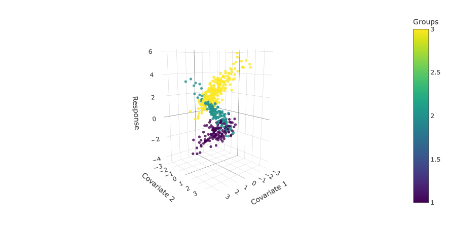
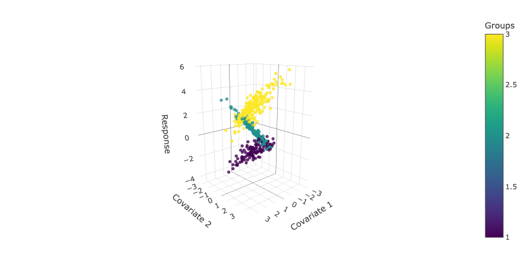

<!-- README.md is generated from README.Rmd. Please edit that file -->

# regMR: Regularized Finite Mixture Regression Models Using MM Algorithm

<!-- badges: start -->

[](https://github.com/vjoshy/regMR/actions/workflows/R-CMD-check.yaml)
[](https://app.codecov.io/gh/vjoshy/regMR)

<!-- badges: end -->

## Overview

regMR provides a comprehensive framework for fitting regularized finite
mixture regression models via a MM algorithm. The sparse group lasso
(sgl) penalty is applied to parameter updates within the MM algorithm
for variable selection with respect to groups and covariates. The
package provides multiple functions for estimation and allows users to
fit models over different lambda-alpha sgl penalty combinations and
group counts. There are four families of finite mixture regression
models able to be fit: Gaussian, Poisson, Binomial, and Gamma. These are
specified using the `family` argument. The models can also be selected
using different information criterion including the default Bayesian
Information Criterion (BIC), group-structured Extended BIC (gEBIC),
Akaike Information Criterion (AIC) , and Integrated Classification
Likelihood (ICL) Criterion. See the documentation for more information
regarding arguments

This readme file provides a brief and basic example on how to use the
regMR package. It walks through generating clustered data to be modeled,
applying one of the main functions, `FMRM()`, to fit a finite Gaussian
mixture regression model to the data using BIC, and how to apply the
plotting and summary methods/functions to the model, getting the most
use out of the package.

## Installation

You can install the development version of regMR from
[GitHub](https://github.com/) with:

``` r
# install.packages("devtools")
library(devtools)
install_github("vjoshy/regMR")
```

You can install the released version of regMR from CRAN using:

``` r
install.packages("regMR")
```

## Example

1.  Data Simulation

To generate the clustered data to fit using regMR, we require the
package mvtnorm to be installed. More information on mvtnorm can be
found here: <https://CRAN.R-project.org/package=mvtnorm>. After setting
the seed to ensure reproducibility of the data, initializing the
simulation parameters (number of samples (`n`), covariates (`p`),
mixture components (`G`), and the correlation constant (`rho`)), and
defining the true parameters for the clusters, we can begin to construct
the multivariate normal data (`X`) and generate the response (`y`).

`X`: To generate `X`, the correlation matrix must first be initialized.
This is done using the following structure:
$\Sigma = \{\rho^{|j - k|}\}^p_{j, k = 1}$. Then, with mean 0 and the
aforementioned correlation structure, `X` (a matrix of size n x p) is
generated using the `rmvnorm()` function from `mvtnorm`.

`y`: To generate `y`, the group responsibilities and mean vector must be
initialized. For the group responsibilities, we use the `rmultinom()`
function coupled with the $\pi$ vector. For the mean vector, we
calculate $\beta_0 + \sum^p_{j = 1}x_{ij}\beta_{gj}$, where i goes from
1 to n and g is the group that the $i^{th}$ observation belongs to.
Then, using the mean vector and the true standard deviations, `y` (a
response vector of length n) is generated with `rnorm()`.

``` r
# install.packages("mvtnorm")
library(mvtnorm)

set.seed(2025)

# ----Simulate data----
n <- 500   # total samples
p <- 6     # number of covariates
G <- 3     # number of mixture components
rho = 0.2  # correlation

# ----True parameters for 3 clusters----
betas <- matrix(c(
  1,  2, -1,  0.5, 0, 0, 0,  # component 1
  5, -2,  1,  0, 0, 0, 0,  # component 2
  -3, 0,  2, 0, 0, 0, 0     # component 3
), nrow = G, byrow = TRUE) / 2
pis <- c(0.4, 0.4, 0.2)
sigmas <- c(0.5, 0.4, 0.3)

# ----Generate correlation matrix----
cor_mat <- outer(1:p, 1:p, function(i, j) rho^abs(i - j))
Sigma <- cor_mat

# ----Simulate design matrix X (n × p)----
X <- mvtnorm::rmvnorm(n, mean = rep(0, p), sigma = Sigma)

# ----Generate responsibilities----
z <- rmultinom(n, size = 1, prob = pis)
groups <- apply(z, 2, which.max)

# ----b0 + b1x1 + b2x2 + ... + bkxp----
mu_vec <- rowSums(cbind(1, X) * betas[groups, ])

# ----Simulate response y----
y <- rnorm(n, mean = mu_vec, sd = sigmas[groups])
```

2.  Model Fitting

We call `FMRM()` with `family = gaussian()` and
`information_criteria = "bic"` to fit a finite Gaussian mixture
regression model to the data. `FMRM()` fits regularized finite mixture
regression models via the MM algorithm over a range of lambda-alpha
pairs (sgl penalty values) and group counts. The maximum group count to
be tested is specified in the function below as `G = 4`. The function
chooses the model with the lowest information criteria value as
specified by the user, which in this case will be BIC.

``` r
# ----Load the regMR package----
library(regMR)
#> 
#> ── regMR ───────────────────────────────
#> Version: 0.0.0.9000
#> Type ?regMR for help
#> ────────────────────────────────────────

# ----Fit model----
fit <- FMRM(x = X, y = y, G = 4, family = gaussian(), 
            information_criteria = "bic", parallel = TRUE)
#> 
#> -- g = 2 --
#> ================================================================================ 
#> 
#>  selected model for g = 2 
#> 
#>  lambda = 26.32 || alpha = 1 ||  BIC  = 1890.43 
#> 
#>  Components     1      2
#>  Pi           0.287  0.713
#>  Sigma        0.340  1.306
#> 
#>  Beta (Regression Parameters)
#>   Components     1      2
#>   Intercept   -1.503  1.861
#>   Beta 1       0.030 -0.271
#>   Beta 2       0.965  0.321
#>   Beta 3       0.009 -0.000
#>   Beta 4       0.000 -0.000
#>   Beta 5       0.046 -0.000
#>   Beta 6       0.000 -0.000
#> 
#> 
#> -- g = 3 --
#> ================================================================================ 
#> 
#>  selected model for g = 3 
#> 
#>  lambda = 54.36 || alpha = 1 ||  BIC  = 1428.6 
#> 
#>  Components     1      2      3
#>  Pi           0.237  0.335  0.428
#>  Sigma        0.279  0.459  0.384
#> 
#>  Beta (Regression Parameters)
#>   Components     1      2      3
#>   Intercept   -1.513  0.502  2.543
#>   Beta 1       0.040  0.984 -1.002
#>   Beta 2       0.990 -0.468  0.492
#>   Beta 3      -0.000  0.179  0.000
#>   Beta 4       0.000  0.000 -0.000
#>   Beta 5       0.029 -0.000 -0.000
#>   Beta 6      -0.000 -0.000 -0.031
#> 
#> 
#> -- g = 4 --
#> ================================================================================ 
#> 
#>  selected model for g = 4 
#> 
#>  lambda = 66.04 || alpha = 0.9 ||  BIC  = 1469.17 
#> 
#>  Components     1      2      3      4
#>  Pi           0.239  0.323  0.025  0.413
#>  Sigma        0.281  0.450  0.021  0.366
#> 
#>  Beta (Regression Parameters)
#>   Components     1      2      3      4
#>   Intercept   -1.515  0.476  2.226  2.554
#>   Beta 1       0.043  0.945  0.328 -1.005
#>   Beta 2       0.983 -0.409  0.017  0.481
#>   Beta 3      -0.000  0.129 -0.019  0.000
#>   Beta 4       0.000  0.008  0.001 -0.000
#>   Beta 5       0.028  0.000  0.042 -0.000
#>   Beta 6      -0.000 -0.000 -0.733 -0.023
#> 
#> -------------------------------------------------------------------------------- 
#> 
#>  overall model chosen ->
#> 
#>  G = 3 
#> 
#>  lambda = 54.36 || alpha = 1 || log-likelihood = -661.47 ||  BIC  = 1428.6 || MSE = 0.12 
#> 
#>  Components     1      2      3
#>  Pi           0.237  0.335  0.428
#>  Sigma        0.279  0.459  0.384
#> 
#>  Beta (Regression Parameters)
#>   Components     1      2      3
#>   Intercept   -1.513  0.502  2.543
#>   Beta 1       0.040  0.984 -1.002
#>   Beta 2       0.990 -0.468  0.492
#>   Beta 3      -0.000  0.179  0.000
#>   Beta 4       0.000  0.000 -0.000
#>   Beta 5       0.029 -0.000 -0.000
#>   Beta 6      -0.000 -0.000 -0.031
#> 
#> --------------------------------------------------------------------------------
```

3.  Use Methods

`plot()` is an S3 method for plotting results from the `FMRM()` and
`MM_Grid()` functions of class FMRM. The function outputs three plots:

1.  Lambdas vs. the ICs of models for all alpha values

2.  Regression parameters over lambdas for all models with the same
    alpha as the optimal alpha.

3.  Group norms over lambdas for all models with the same alpha as the
    optimal alpha.

``` r
plot(fit)
#> [[1]]
```


    #> 
    #> [[2]]


    #> 
    #> [[3]]


`plot2()` plots two specified covariates of the predictor/design matrix
(`X`) against a response vector (`y` or `y_hat`). The observations are
coloured per the group responsibility matrix (`z_hard`) in the finite
mixture regression model passed to the function.

``` r
plot2(fit, X, y, 1, 2)
```



``` r
plot2(fit, X, fit$parameters$y_hat, 1, 2)
```



`summary()` is an S3 method for summarizing results from the `FMRM()`
and `MM_Grid()` functions of class FMRM. Outputs the number of mixture
components, optimal lambda-alpha pair, log-likelihood, ic, mean squared
error, and parameters of the model.

``` r
summary(fit)
#> =======================================================================
#> Regularized Finite Gaussian Mixture Regression Model Using MM Algorithm
#> =======================================================================
#> 
#> Call:
#>  FMRM(x = X, y = y, G = 4, family = gaussian(), information_criteria = "bic",      parallel = TRUE) 
#> 
#>  G = 3 
#> 
#>  lambda = 54.36 || alpha = 1 || log-likelihood = -661.47 || 
#>  BIC  = 1428.6 || MSE = 0.12 
#> 
#>  Components     1      2      3
#>  Pi           0.237  0.335  0.428
#>  Clusters       123    151    226
#>  Sigma        0.279  0.459  0.384
#> 
#>  Beta (Regression Parameters)
#>   Components     1      2      3
#>   Intercept   -1.513  0.502  2.543
#>   Beta 1       0.040  0.984 -1.002
#>   Beta 2       0.990 -0.468  0.492
#>   Beta 3      -0.000  0.179  0.000
#>   Beta 4       0.000  0.000 -0.000
#>   Beta 5       0.029 -0.000 -0.000
#>   Beta 6      -0.000 -0.000 -0.031
```

4.  Computational Speed
