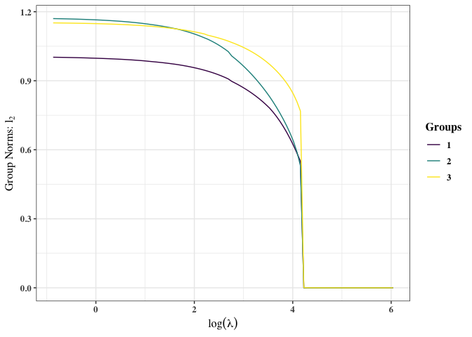
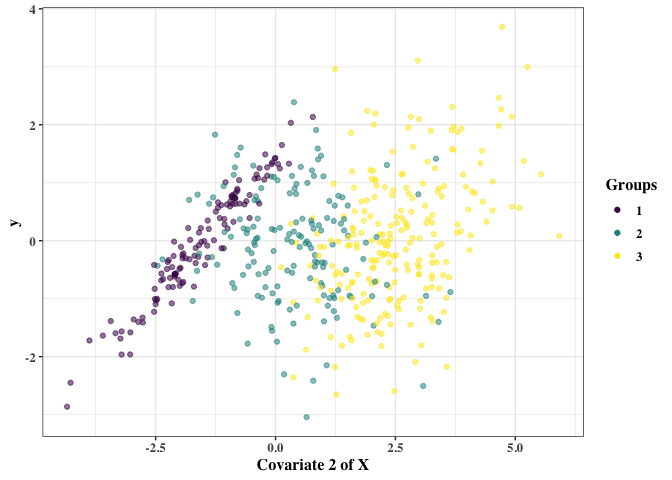

<!-- README.md is generated from README.Rmd. Please edit that file -->

# regMR: Regularized Finite Mixture Regression Models Using MM Algorithm

<!-- badges: start -->

[](https://github.com/vjoshy/regMR/actions/workflows/R-CMD-check.yaml)
[](https://app.codecov.io/gh/vjoshy/regMR)

<!-- badges: end -->

## Overview

regMR provides a comprehensive framework for fitting regularized finite
mixture regression models via the MM algorithm. The sparse-group-lasso
(sgl) penalty is applied to parameter updates within the MM algorithm
for variable selection. The package provides multiple functions for
estimation and allows users to fit finite mixture regression models over
different lambda-alpha sgl penalty combinations and group counts.

This readme file provides a brief and basic example on how to use the
regMR package. It walks through generating clustered data to be modeled,
applying one of the main functions, `FGMRM()`, to fit a finite Gaussian
mixture regression model to the data, and how to apply the plotting and
summary methods/functions to the model, getting the most use out of the
package.

The methods implemented are based on research by Grace Stelter \[INSERT
PAPER HERE\].

## Installation

You can install the development version of regMR from
[GitHub](https://github.com/) with:

``` r
# install.packages("devtools")
library(devtools)
install_github("vjoshy/regMR")
```

You can install the released version of regMR from CRAN using:

``` r
install.packages("regMR")
```

## Example

1.  Generate clustered data to be modeled

To generate the clustered data to be modeled using regMR, we require the
package mvtnorm to be installed. More information on mvtnorm can be
found here: <https://CRAN.R-project.org/package=mvtnorm>. After setting
the seed to ensure reproducibility of the data, initializing the
simulation parameters (number of samples (`n`), covariates (`p`),
mixture components (`G`), and the correlation constant (`rho`)), and
defining the true parameters for the clusters, we can begin to construct
the multivariate normal data (`X`) and generate the response (`y`).

`X`: To generate `X`, the correlation matrix must first be initialized.
This is done using the following structure from \[GRACE THESIS\]:
$\Sigma = \{\rho^{|j - k|}\}^p_{j, k = 1}$. Then, with mean 0 and the
aforementioned correlation structure, `X` (a matrix of size n x p) is
generated using the `rmvnorm()` function from mvtnorm.

`y`: To generate `y`, the group responsibilities and mean vector must be
initialized. For the group responsibilities, we use the `rmultinom()`
function coupled with the $\pi$ vector. For the mean vector, we
calculate $\beta_0 + \sum^p_{j = 1}x_{ij}\beta_{gj}$, where i goes from
1 to n and g is the group that the $i^{th}$ observation belongs to.
Then, using the mean vector and the true standard deviations, `y` (a
vector of length n) is generated with `rnorm()`.

``` r
# install.packages("mvtnorm")

set.seed(2025)

# ----Simulate data----
n <- 500   # total samples
p <- 6     # number of covariates
G <- 3     # number of mixture components
rho = 0.2  # correlation

# ----True parameters for 3 clusters----
betas <- matrix(c(
  1,  2, -1,  0.5, 0, 0, 0,  # component 1
  5, -2,  1,  0, 0, 0, 0,  # component 2
  -3, 0,  2, 0, 0, 0, 0     # component 3
), nrow = G, byrow = TRUE)
pis <- c(0.4, 0.4, 0.2)
sigmas <- c(0.5, 0.4, 0.3)

# ----Generate correlation matrix----
cor_mat <- outer(1:p, 1:p, function(i, j) rho^abs(i - j))
Sigma <- cor_mat

# ----Simulate design matrix X (n × p)----
X <- mvtnorm::rmvnorm(n, mean = rep(0, p), sigma = Sigma)

# ----Generate responsibilities----
z <- rmultinom(n, size = 1, prob = pis)
groups <- apply(z, 2, which.max)

# ----b0 + b1x1 + b2x2 + ... + bkxp----
mu_vec <- rowSums(cbind(1, X) * betas[groups, ])

# ----Simulate response y----
y <- rnorm(n, mean = mu_vec, sd = sigmas[groups])
```

2.  Call `FGMRM()` to fit a finite Gaussian mixture regression model to
    the data

`FGMRM()` fits regularized finite Gaussian mixture regression models via
the MM algorithm over a range of lambda-alpha pairs (sgl penalty values)
and group counts. The maximum group count to be tested is specified in
the function below as `G = 6`. The function chooses the model with the
lowest BIC value.

``` r
# ----Load the regMR package----
library(regMR)

# ----Fit model----
mod <- FGMRM(x = X, y = y, G = 6)
#> 
#> -- g = 2 --
#> ================================================================================ 
#> 
#>  selected model for g = 2 
#> 
#>  lambda = 19.74 || alpha = 0.9 || BIC = 2208.94 
#> 
#>  Components     1      2
#>  Pi           0.578  0.422
#>  Sigma        2.561  0.390
#> 
#>  Beta (Regression Parameters)
#>   Components     1      2
#>   Intercept   -0.586  5.052
#>   Beta 1       1.135 -1.952
#>   Beta 2       0.284  0.951
#>   Beta 3       0.267  0.000
#>   Beta 4       0.000  0.000
#>   Beta 5      -0.076  0.000
#>   Beta 6       0.000  0.000
#> 
#> 
#> -- g = 3 --
#> ================================================================================ 
#> 
#>  selected model for g = 3 
#> 
#>  lambda = 9.96 || alpha = 1 || BIC = 1541.01 
#> 
#>  Components     1      2      3
#>  Pi           0.236  0.340  0.424
#>  Sigma        0.289  0.483  0.379
#> 
#>  Beta (Regression Parameters)
#>   Components     1      2      3
#>   Intercept   -3.019  0.998  5.048
#>   Beta 1       0.000  1.941 -1.994
#>   Beta 2       1.940 -1.009  0.977
#>   Beta 3       0.000  0.459  0.000
#>   Beta 4       0.000  0.000  0.000
#>   Beta 5       0.000  0.000  0.000
#>   Beta 6       0.000  0.000 -0.029
#> 
#> 
#> -- g = 4 --
#> ================================================================================ 
#> 
#>  selected model for g = 4 
#> 
#>  lambda = 12.33 || alpha = 0.8 || BIC = 1569.28 
#> 
#>  Components     1      2      3      4
#>  Pi           0.237  0.336  0.003  0.424
#>  Sigma        0.293  0.478  0.113  0.384
#> 
#>  Beta (Regression Parameters)
#>   Components     1      2      3      4
#>   Intercept   -3.024  1.005  0.171  5.050
#>   Beta 1       0.000  1.931  0.000 -1.979
#>   Beta 2       1.919 -0.991  0.000  0.970
#>   Beta 3       0.000  0.431  0.000  0.000
#>   Beta 4       0.000  0.000  0.000  0.000
#>   Beta 5       0.000  0.000  0.000  0.000
#>   Beta 6       0.000  0.000  0.000 -0.000
#> 
#> 
#> -- g = 5 --
#> ================================================================================ 
#> 
#>  selected model for g = 5 
#> 
#>  lambda = 7.5 || alpha = 0.5 || BIC = 1588.4 
#> 
#>  Components     1      2      3      4      5
#>  Pi           0.237  0.335  0.005  0.000  0.424
#>  Sigma        0.289  0.476  0.017  0.068  0.379
#> 
#>  Beta (Regression Parameters)
#>   Components     1      2      3      4      5
#>   Intercept   -3.018  0.988  2.310  0.000  5.047
#>   Beta 1       0.018  1.940  0.000  0.000 -1.995
#>   Beta 2       1.932 -1.022  0.000  0.000  0.982
#>   Beta 3       0.000  0.455  0.000  0.000 -0.002
#>   Beta 4       0.000  0.000  0.000  0.000  0.000
#>   Beta 5       0.000  0.000  0.000  0.000  0.000
#>   Beta 6       0.000 -0.006  0.000  0.000 -0.024
#> 
#> 
#> -- g = 6 --
#> ================================================================================ 
#> 
#>  selected model for g = 6 
#> 
#>  lambda = 10.17 || alpha = 1 || BIC = 1582.99 
#> 
#>  Components     1      2      3      4      5      6
#>  Pi           0.237  0.004  0.330  0.005  0.000  0.424
#>  Sigma        0.289  0.132  0.466  0.017  1.466  0.380
#> 
#>  Beta (Regression Parameters)
#>   Components     1      2      3      4      5      6
#>   Intercept   -3.021  0.124  0.997  2.310  0.000  5.049
#>   Beta 1       0.000  0.000  1.942  0.000  0.000 -1.993
#>   Beta 2       1.937  0.000 -1.007  0.000  0.000  0.975
#>   Beta 3       0.000  0.000  0.451  0.000  0.000  0.000
#>   Beta 4       0.000  0.000  0.000  0.000  0.000  0.000
#>   Beta 5       0.000  0.000  0.000  0.000  0.000  0.000
#>   Beta 6       0.000  0.000  0.000  0.000  0.000 -0.029
#> 
#> -------------------------------------------------------------------------------- 
#> 
#>  overall model chosen ->
#> 
#>  G = 3 
#> 
#>  lambda = 9.96 || alpha = 1 || log-likelihood = -720.79 || BIC = 1541.01 || MSE = 0.14 
#> 
#>  Components     1      2      3
#>  Pi           0.236  0.340  0.424
#>  Sigma        0.289  0.483  0.379
#> 
#>  Beta (Regression Parameters)
#>   Components     1      2      3
#>   Intercept   -3.019  0.998  5.048
#>   Beta 1       0.000  1.941 -1.994
#>   Beta 2       1.940 -1.009  0.977
#>   Beta 3       0.000  0.459  0.000
#>   Beta 4       0.000  0.000  0.000
#>   Beta 5       0.000  0.000  0.000
#>   Beta 6       0.000  0.000 -0.029
#> 
#> --------------------------------------------------------------------------------
```

3.  Use `plot()`, `plot2()`, and `summary()` on the finite Gaussian
    mixture regression model from `FGMRM()`

`plot()` is an S3 method for plotting results (class FGMRM) from the
`FGMRM()` and `MM_Grid_FGMRM()` functions. The function outputs three
plots:

1.  Lambdas vs. the BICs of models for all alpha values

2.  Regression parameters over lambdas for all models with the same
    alpha as the optimal alpha.

3.  Group norms over lambdas for all models with the same alpha as the
    optimal alpha.

``` r
plot(mod)
#> [[1]]
```


    #> 
    #> [[2]]


    #> 
    #> [[3]]



`plot2()` plots a specified covariate of the predictor/design matrix
(`X`) against the response vector (`y`). The observations are coloured
per the group responsibility matrix (`z_hard`) in the finite Gaussian
mixture regression model of class FGMRM passed to the function.

``` r
plot2(mod, X, y, 2) # covariate two
```



`summary()` is an S3 method for summarizing results (class FGMRM) from
the `FGMRM()` and `MM_Grid_FGMRM()` functions. Outputs the number of
mixture components, optimal lambda-alpha, log-likelihood, bic,
mean-squared-error, and parameters (pi, sigma, beta) of the model.

``` r
summary(mod)
#> =======================================================================
#> Regularized Finite Gaussian Mixture Regression Model Using MM Algorithm
#> =======================================================================
#> 
#>  G = 3 
#> 
#>  lambda = 9.96 || alpha = 1 || log-likelihood = -720.79 || 
#>  BIC = 1541.01 || MSE = 0.14 
#> 
#>  Components     1      2      3
#>  Pi           0.236  0.340  0.424
#>  Clusters       118    165    217
#>  Sigma        0.289  0.483  0.379
#> 
#>  Beta (Regression Parameters)
#>   Components     1      2      3
#>   Intercept   -3.019  0.998  5.048
#>   Beta 1       0.000  1.941 -1.994
#>   Beta 2       1.940 -1.009  0.977
#>   Beta 3       0.000  0.459  0.000
#>   Beta 4       0.000  0.000  0.000
#>   Beta 5       0.000  0.000  0.000
#>   Beta 6       0.000  0.000 -0.029
```
