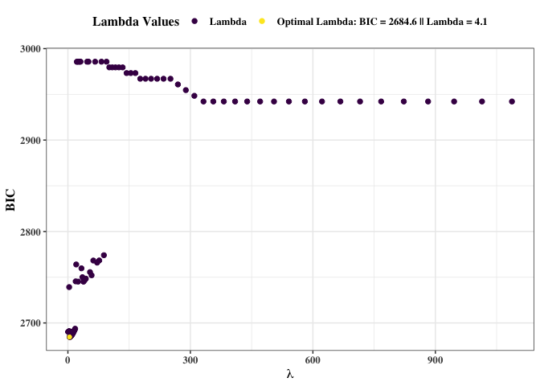
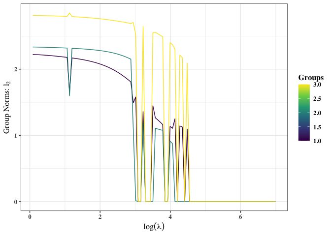
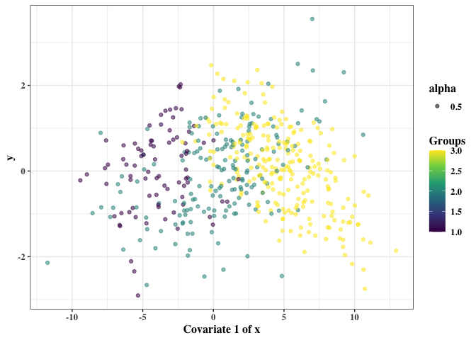
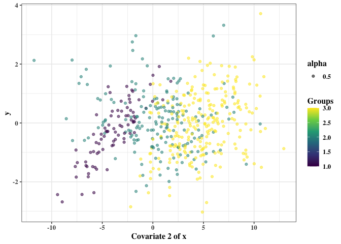
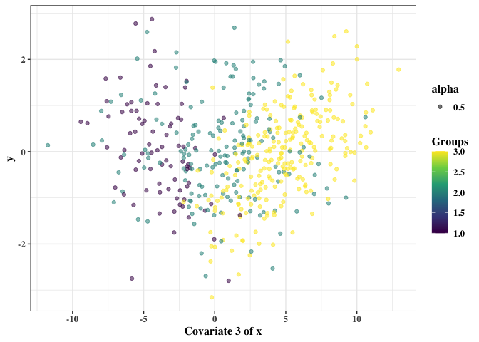

<!-- README.md is generated from README.Rmd. Please edit that file -->

# regMR: Regularized Finite Mixture Regression Models Using MM Algorithm

<!-- badges: start -->

[](https://github.com/vjoshy/regMR/actions/workflows/R-CMD-check.yaml)
[](https://app.codecov.io/gh/vjoshy/regMR)

<!-- badges: end -->

## Overview

regMR provides a comprehensive framework for regularized finite mixture
regression models using the MM algorithm.

The methods implemented are based on research by \[INSERT HERE\].

## Installation

You can install the development version of regMR from
[GitHub](https://github.com/) with:

``` r
# install.packages("devtools")
library(devtools)
install_github("vjoshy/regMR")
```

## Key Functions

The regMR package includes the following functions for use:

### `FGMRM()`

Fits Regularized Finite Gaussian Mixture Regression Model Using MM
Algorithm over range of lambda-alpha pairs and group counts.

### `MM_Grid_FGMRM()`

Fits Regularized Finite Gaussian Mixture Regression Model Using MM
Algorithm over range of lambda-alpha pairs.

### `MM_FGMRM()`

Fits Regularized Finite Gaussian Mixture Regression Model Using MM
Algorithm.

### `summary()`

S3 method for summarizing results from the `FGMRM()` and
`MM_Grid_FGMRM()` functions of class FGMRM. Outputs the number of
mixture components, optimal lambda-alpha, log-likelihood, bic,
mean-squared-error, and parameters (pi, sigma, beta) of the model.

### `plot()`

S3 method for plotting results from the `FGMRM()` and `MM_Grid_FGMRM()`
functions of class FGMRM. Outputs three plots:

1.  Lambdas vs. the BICs of models with the same alpha as the optimal
    alpha.
2.  Regression parameters over lambdas for all models with the same
    alpha as the optimal alpha.
3.  Group norms over lambdas for all models with the same alpha as the
    optimal alpha.

### `plot2()`

Plots a specified covariate of the predictor/design matrix (x) against
the response vector (y). The observations are coloured per the group
responsibility matrix (z_hard) in the finite Gaussian mixture regression
model of class FGMRM passed to the function.

## Example

This is a basic example which shows you how to use all aspects of the
regMR package:

``` r
# ----Load the regMR package----
library(regMR)

# install.packages("mvtnorm")

set.seed(2025)

# ----Simulate data----
n <- 500   # total samples
p <- 3     # number of covariates
G <- 3     # number of mixture components
rho = 0.2  # correlation

# ----True parameters for 3 clusters----
betas <- matrix(c(
  1,  2, -1,  0.5,   # Component 1
  5, -2,  1,  1.5,   # Component 2
  -3, 0,  2, -1      # Component 3
), nrow = G, byrow = TRUE)
pis <- c(0.4, 0.4, 0.2)
sigmas <- c(3, 1.5, 1)

# ----Generate correlation matrix----
cor_mat <- outer(1:p, 1:p, function(i, j) rho^abs(i - j))
Sigma <- cor_mat

# ----Simulate design matrix X (n × p)----
X <- mvtnorm::rmvnorm(n, mean = rep(0, p), sigma = Sigma)

# ----Generate responsibilities----
z <- rmultinom(n, size = 1, prob = pis)
groups <- apply(z, 2, which.max)

# ----b0 + b1x1 + b2x2 + ... + bkxp----
mu_vec <- rowSums(cbind(1, X) * betas[groups, ])

# ----Simulate response y----
y <- rnorm(n, mean = mu_vec, sd = sigmas[groups])

mod <- FGMRM(x = X, y = y, G = 6)
#> 
#> -- g = 2 --
#> ================================================================================ 
#> 
#>  selected model for g = 2 
#> 
#>  lambda = 0.98 || alpha = 1 || BIC = 2730.52 
#> 
#>  Components     1      2
#>  Pi           0.577  0.423
#>  Sigma        3.676  1.259
#> 
#>  Beta (Regression Parameters)
#>   Components     1      2
#>   Intercept   -0.418  5.128
#>   Beta 1       1.164 -2.074
#>   Beta 2       0.296  0.877
#>   Beta 3      -0.420  1.675
#> 
#> 
#> -- g = 3 --
#> ================================================================================ 
#> 
#>  selected model for g = 3 
#> 
#>  lambda = 4.09 || alpha = 1 || BIC = 2684.63 
#> 
#>  Components     1      2      3
#>  Pi           0.145  0.422  0.433
#>  Sigma        0.799  3.086  1.281
#> 
#>  Beta (Regression Parameters)
#>   Components     1      2      3
#>   Intercept   -3.238  0.793  5.082
#>   Beta 1       0.000  1.950 -2.078
#>   Beta 2       1.927 -1.191  0.906
#>   Beta 3      -0.960  0.332  1.622
#> 
#> 
#> -- g = 4 --
#> ================================================================================ 
#> 
#>  selected model for g = 4 
#> 
#>  lambda = 3.48 || alpha = 1 || BIC = 2701.54 
#> 
#>  Components     1      2      3      4
#>  Pi           0.154  0.379  0.108  0.359
#>  Sigma        0.826  2.964  0.979  1.077
#> 
#>  Beta (Regression Parameters)
#>   Components     1      2      3      4
#>   Intercept   -3.205  0.712  3.447  5.299
#>   Beta 1       0.000  2.266 -1.340 -2.124
#>   Beta 2       1.947 -1.373  1.681  0.852
#>   Beta 3      -0.976  0.355  0.171  1.748
#> 
#> 
#> -- g = 5 --
#> ================================================================================ 
#> 
#>  selected model for g = 5 
#> 
#>  lambda = 3.71 || alpha = 1 || BIC = 2719.09 
#> 
#>  Components     1      2      3      4      5
#>  Pi           0.157  0.346  0.032  0.105  0.360
#>  Sigma        0.839  2.999  0.888  0.965  1.081
#> 
#>  Beta (Regression Parameters)
#>   Components     1      2      3      4      5
#>   Intercept   -3.212  0.636  1.338  3.514  5.309
#>   Beta 1       0.000  2.378  0.000 -1.303 -2.112
#>   Beta 2       1.931 -1.431  0.000  1.668  0.851
#>   Beta 3      -0.974  0.327  0.000  0.193  1.740
#> 
#> 
#> -- g = 6 --
#> ================================================================================ 
#> 
#>  selected model for g = 6 
#> 
#>  lambda = 10.37 || alpha = 0.7 || BIC = 2730.53 
#> 
#>  Components     1      2      3      4      5      6
#>  Pi           0.144  0.027  0.044  0.016  0.309  0.460
#>  Sigma        0.845  0.229  0.758  0.019  3.132  1.377
#> 
#>  Beta (Regression Parameters)
#>   Components     1      2      3      4      5      6
#>   Intercept   -3.492 -1.836  0.827  2.408  0.728  5.058
#>   Beta 1       0.000  0.000  0.000  0.000  2.335 -1.952
#>   Beta 2       1.710  0.000  0.000  0.000 -1.351  0.910
#>   Beta 3      -0.811  0.000  0.000  0.000  0.313  1.533
#> 
#> -------------------------------------------------------------------------------- 
#> 
#>  overall model chosen ->
#> 
#>  G = 3 
#> 
#>  lambda = 4.09 || alpha = 1 || log-likelihood = -1292.6 || BIC = 2684.63 || MSE = 3.2 
#> 
#>  Components     1      2      3
#>  Pi           0.145  0.422  0.433
#>  Sigma        0.799  3.086  1.281
#> 
#>  Beta (Regression Parameters)
#>   Components     1      2      3
#>   Intercept   -3.238  0.793  5.082
#>   Beta 1       0.000  1.950 -2.078
#>   Beta 2       1.927 -1.191  0.906
#>   Beta 3      -0.960  0.332  1.622
#> 
#> --------------------------------------------------------------------------------

plot(mod)
#> [[1]]
```



    #> 
    #> [[2]]


    #> 
    #> [[3]]



``` r

plot2(mod, X, y, 1)
```



``` r
plot2(mod, X, y, 2)
```



``` r
plot2(mod, X, y, 3)
```



``` r

summary(mod)
#> =======================================================================
#> Regularized Finite Gaussian Mixture Regression Model Using MM Algorithm
#> =======================================================================
#> 
#>  G = 3 
#> 
#>  lambda = 4.09 || alpha = 1 || log-likelihood = -1292.6 || BIC = 2684.63 || MSE = 3.2 
#> 
#>  Components     1      2      3
#>  Pi           0.145  0.422  0.433
#>  Clusters        82    173    245
#>  Sigma        0.799  3.086  1.281
#> 
#>  Beta (Regression Parameters)
#>   Components     1      2      3
#>   Intercept   -3.238  0.793  5.082
#>   Beta 1       0.000  1.950 -2.078
#>   Beta 2       1.927 -1.191  0.906
#>   Beta 3      -0.960  0.332  1.622
```
